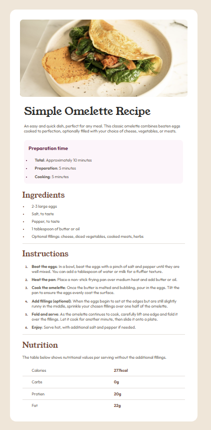

# Frontend Mentor - Recipe page solution

This is a solution to the [Recipe page challenge on Frontend Mentor](https://www.frontendmentor.io/challenges/recipe-page-KiTsR8QQKm). Frontend Mentor challenges help you improve your coding skills by building realistic projects. 

## Table of contents

- [Overview](#overview)
  - [The challenge](#the-challenge)
  - [Screenshot](#screenshot)
  - [Links](#links)
- [My process](#my-process)
  - [Built with](#built-with)
  - [What I learned](#what-i-learned)
  - [Useful resources](#useful-resources)
  - [AI Collaboration](#ai-collaboration)
- [Author](#author)

## Overview

### Screenshot




## Links

- [Solution URL](https://github.com/AdonayMendez/frontend-mentor-recipe-page.git)
- [Live Site URL](https://your-live-site-url.com)

## My process

### Built with

- Semantic HTML5 markup
- CSS custom properties
- Flexbox
- Mobile-first workflow

### What I learned

Tabular data: Learned how to display info in an organized layout consisting of rows and columms

```html
<table>
  <tr>
    <td>
      <p>Calories</p>
    </td>
    <td>
      <p><span>277kcal</span></p>
    </td>
  </tr> 
```

border-collapse: collapse; To merge borders of adjacent cells in a table into one, eliminating the gaps between them.

```css
table{
    width: 100%;
    border: none;
    border-collapse: collapse;
}
```

:last-child: To target the last chile of a specific type in an element.

```css
tr:last-child td{
  border-bottom: none; 
}
```

::marker: A way to directly style the marker box (bullet point or number) of a list item.

```css
li::marker{
  font-size: 10px;
}

li::marker{
  color: var(--brown800);
  -family: "Outfit", serif;
  font-weight: bold;
}
```


@media (400px < width <= 595px): To change styling within a range

```css
@media (400px < width <= 595px){
    body{
    padding: 0px;
  }

  main{
    padding: 0; 
  }

  .recipe-details{
    padding: 1rem 1.3rem 0rem 1.3rem;
  }
}
```

### Useful resources

- [W3schools](https://www.w3schools.com/) - Helped me understand many different html and css concepts. 


### AI Collaboration (ChatGPT)

Used this tool to:
- Help understand when to use px or rem. 
- Understand how to merge table borders (border-collapse). 
- Remove last table row bottom border (tr:last-child...).
- Review the efficiency of my code and correct any ambiguities

## Author
- Frontend Mentor - [@AdonayMendez](https://www.frontendmentor.io/home)
